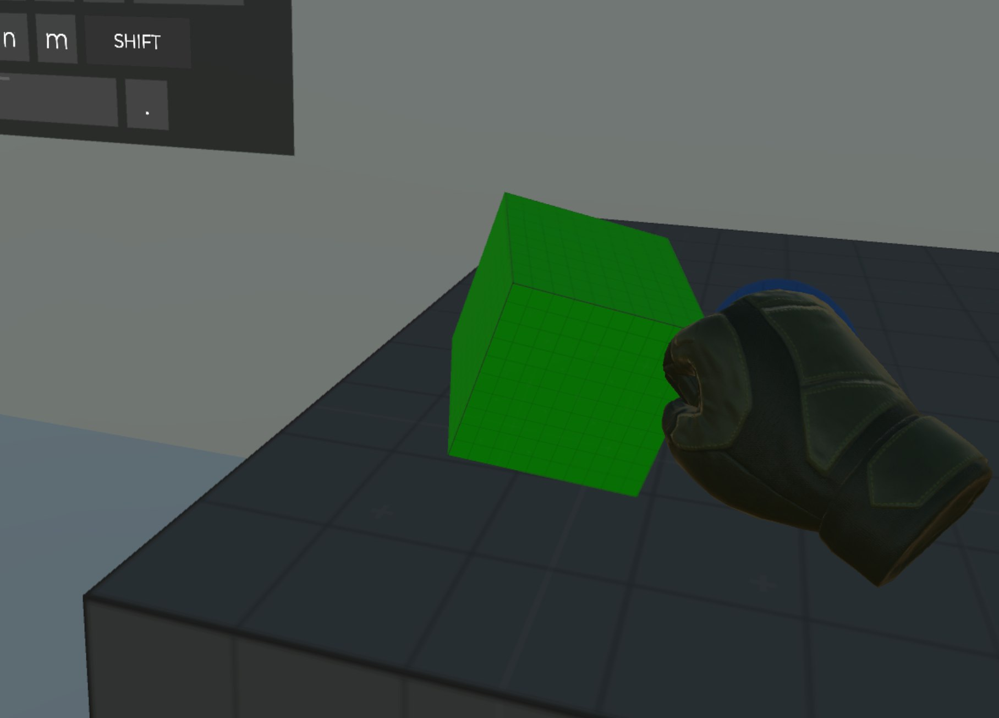
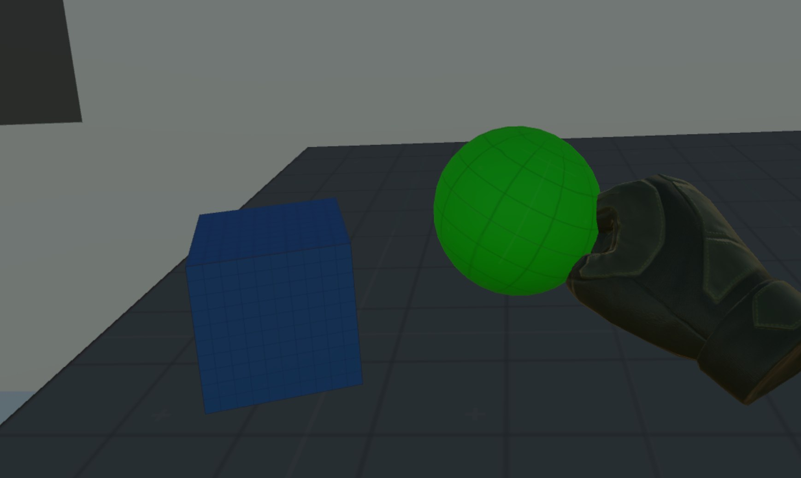
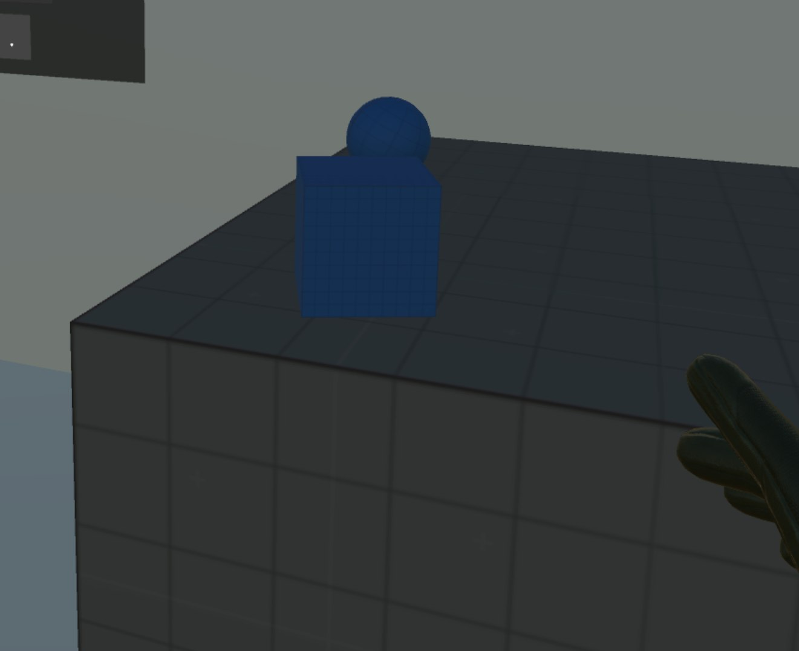
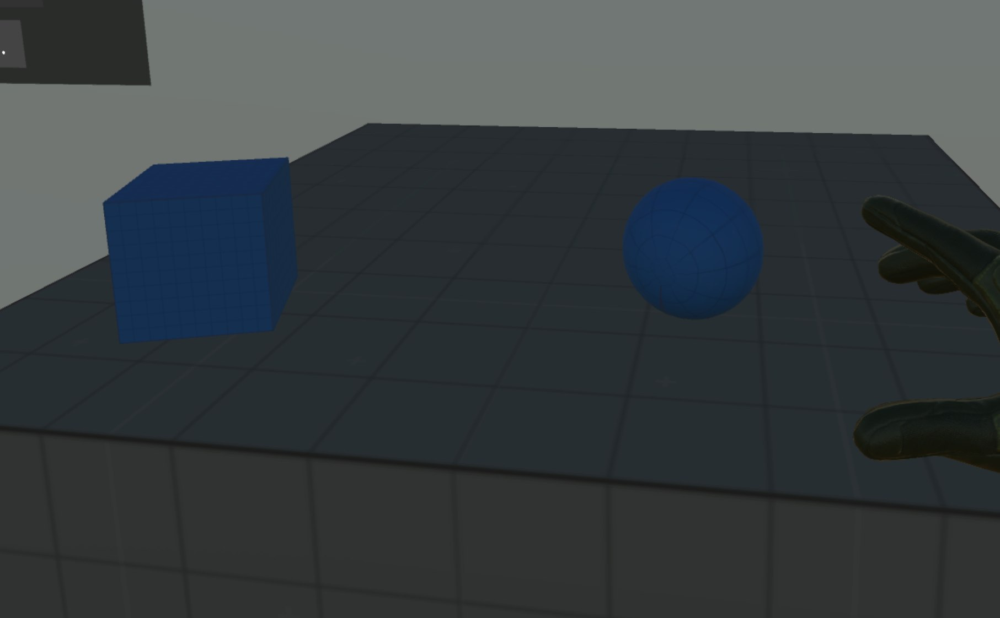
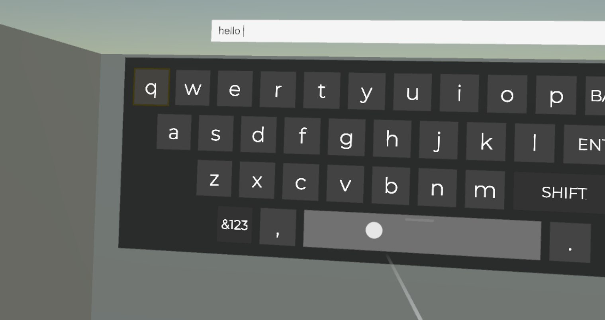
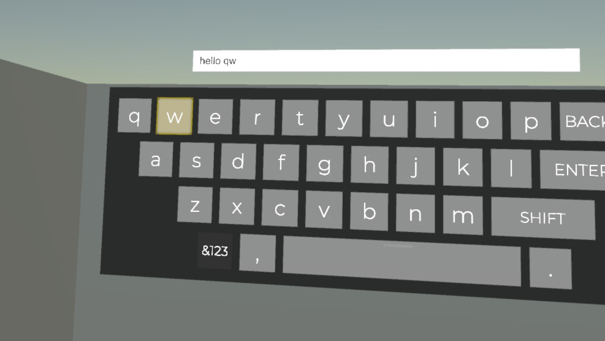

## Требования

- **Unity:** `2021.3.45f2`
- **Плагин:** `VRIF 1.82+`
- **Платформы:** SteamVR (PC), Oculus Quest 2 / 3

## Запуск

1. Убедиться, что установлен плагин **VRIF 1.82+**
2. Открыть сцену `VRScene` в папке `Assets/Scenes`.
3. Убедиться, что платформа выставлена корректно:
   - **SteamVR (PC):** `File - Build Settings - PC, Mac & Linux Standalone (Windows)`.
   - **Oculus Quest 2/3:** `File - Build Settings - Android`.
4. Подключить VR‑шлем.
5. Нажать **Play** в Unity - сцена запускается с активным VR‑управлением:
   - можно брать и отпускать объекты;
   - работает ограничение области перемещения;
   - работает VR‑клавиатура (лучом и джойстиком).

## Сборка

### Общие шаги

1. Открыть `File - Build Settings`.
2. Нажать **Add Open Scenes** (добавить `VRScene`).
3. Убедиться, что выбран нужный **Target Platform**.

### SteamVR (PC)
- **Платформа:** PC, Mac & Linux Standalone, архитектура Windows x86_64.
- Использовать **OpenXR/SteamVR** в `Project Settings - XR Plug-in Management`.
- Нажать **Build** и указать папку для билда.
- Запустить `.exe` через SteamVR.

### Oculus Quest 2
- **Платформа:** Android, архитектура ARM.
- Включить **Oculus/OpenXR** в `Project Settings - XR Plug-in Management`.
- Нажать **Build**.
- Установить и запустить собранный `.apk` на устройстве.


## Реализованный функционал

#### Сцена с объектами для взаимодействия
- На сцене размещены несколько объектов (куб и сфера).
- Объекты помечены как **Grabbable** (через VRIF) и могут:
  - браться VR‑контроллерами;
  - перемещаться и отпускаться в пространстве.

#### Изменение цвета при захвате
- При **grab** объекта срабатывает событие, которое меняет его цвет.




- При **release** цвет возвращается к исходному.



- Логика вынесена в отдельный скрипт `GrabbableColorChanger` в `Assets/Scripts/Interaction`.

#### Ограниченное перемещение игрока
- Игрок ограничен в пределах заданной зоны.
- Визуальные/физические границы реализованы:
  - коллайдерами по периметру;
  - дополнительной логикой ограничения в скрипте `PlayerBoundsLimiter` (папка `Assets/Scripts/Player`).

#### VR‑клавиатура
- Используется префаб VR‑клавиатуры из VRIF (**VR Keyboard**).
- Ввод текста реализован через `BNG.VRKeyboard` и логику в `Assets/Scripts/UI`.
- Текст отображается в поле над клавиатурой и обновляется при каждом нажатии клавиш.

#### Два режима ввода 
ВАЖНО: Для смены режима ввода нажать на кнопку "А" на контроллере

1. **Классический режим:**
   - Нажатия на клавиши выполняются лучом.
   - Клавиши - UI‑кнопки, вызывающие `VRKeyboardKey.OnKeyHit()`.


2. **Навигация джойстиком:**
   - Перемещение по клавишам по двум осям с помощью thumbstick.
   - Текущая выбранная клавиша подсвечивается жёлтой рамкой.


## Архитектура

```text
Assets/
├── BNG Framework/          # плагин VRIF
├── Scripts/                # весь код тестового задания
│   ├── Player/             # логика игрока и ограничения
│   │   └── PlayerBoundsLimiter.cs # Ограничение перемещения игрока
│   ├── Interaction/        # взаимодействие с объектами
│   │   ├── GrabbableColorChanger.cs # изменение цвета объекта при захвате/отпускании
│   │   └── ThumbstickGrabToggle.cs # управление хватанием и отпусканием объектов по нажатию на кнопку джойстика
│   └── UI/                 # логика VR‑клавиатуры и ввода
│       └── VRKeyboardRuntimeInput.cs # управление логикой работы с клавиатуройв
```

### VR‑взаимодействие
- Базовые `grab/release` реализованы через компоненты VRIF (`Grabber`, `Grabbable` и др.).
- Собственные скрипты подписываются на события VRIF (через компоненты/интерфейсы) и дополняют поведение:
  - смена цвета при захвате;
  - ограничение перемещения игрока;
  - переключение `grab` по нажатию стика.

### VR‑клавиатура и ввод
- Используется встроенный `BNG.VRKeyboard` префаб и `VRKeyboardKey`.
- Собственный контроллер `VRKeyboardRuntimeInput`:
  - на старте находит `VRKeyboard` в сцене;
  - создаёт или находит текстовое поле `InputField` над клавиатурой и привязывает к нему ввод;
  - реализует навигацию по клавишам с помощью `InputBridge` (ось джойстика);
  - обрабатывает подтверждение.
